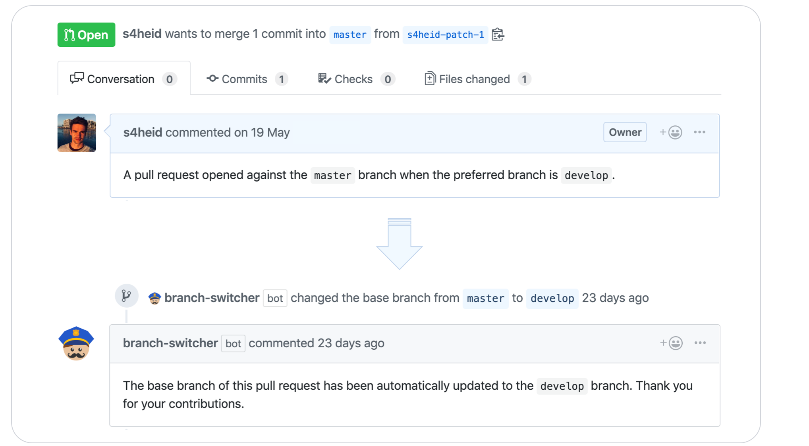

# branch-switcher

[](https://travis-ci.org/s4heid/branch-switcher)
[](https://standardjs.com)

A GitHub App built with [Probot](https://github.com/probot/probot) that automatically
updates the base ref of a pull request if it has been opened against a non-preferred
branch.


## How it works

In projects where the default branch is not master, pull requests are often opened against a wrong branch. Typically, maintainers of the project need to reach out to the authors and ask them to change the base branch as most bigger projects have automated tests configured against the default branch.

The intent of this GitHub app is to support maintainers by automatically changing the base branch of pull requests to the default branch if applicable. The app listens to a set of [webhooks](https://developer.github.com/v3/activity/events/types/#pullrequestevent):

- `pull_request.opened`,
- `pull_request.reopened`,
- `pull_request.edited`,
- `pull_request.labeled`,
- `pull_request.unlabeled`,

which triggers

- a check whether the base branch of the pull request matches the preferred branch and changes it if applicable,
- comments on the pull request and informs the author about the changes being made.




## Installation

1. [Install the GitHub App](https://github.com/apps/branch-switcher) for the intended repositories
1. Create a `.github/switch.yml` file in the root of the intended repositories where
branch-switcher has been installed. This configuration file is optional and overrides any of the default
settings.


## Configuration

The following properties are currently supported:

 * `preferredBranch` *(string)* - name of the preferred branch against which the
   pull request should be opened. Default: develop.
 * `switchComment` *(string)* - content of the message indicating that the base
   has been updated to the preferred branch. `{{author}}` can be used as a placeholder
   which interpolates to the pull request author and `{{preferredBranch}}` analogously.
 * `exclude` *(Array)* - list of all branches and labels that should be ignored.
   By default, all branches are considered and no labels are excluded.
   - `branch` *(string)* - name of the branch that should be ignored.
   - `label` *(string)* - name of the label that should be ignored.

**Example** `.github/switch.yml`:

```yaml
exclude:
- branch: do-nothing
- branch: dont-touch-*
- label: ignore-me
switchComment: >
  Hey @{author}, the base branch of your pull request has been changed.
  Have a nice day! :wave:
```

Above config does not touch the base branch if there is a label `ignore-me` attached
on the pull request and it also does not switch if the base branch is either called
`do-nothing` or every branch matching the wildcard `dont-touch-*`.


## Development

1. Follow the [docs for deployment](https://probot.github.io/docs/deployment) and
set the following **Permissions & events** for the GitHub App:

  - Pull requests - **Read & Write**
    - [x] Check the box for **Pull request review comment** events
  - Repository metadata - **Read-only**
  - Single File - **Read-only**
    - Path: `.github/switch.yml`
1. Clone the repo:
  ```sh
  git clone git@github.com:s4heid/branch-switcher.git
  ```
1. Copy [.env.example](.env.example) to `.env` and set the right environment variables as described in the official [probot docs](https://probot.github.io/docs/configuration)
1. Install app dependencies and run the app:
  ```sh
  # Install dependencies
  npm install

  # Run typescript and run the bot
  npm run build && npm start
  ```


## Contributing

If you have suggestions for how branch-switcher could be improved, or want to report a bug, open an issue! We'd love all and any contributions.

For more, check out the [Contributing Guide](CONTRIBUTING.md).


## License

[ISC](LICENSE) © 2019 Sebastian Heid <sebastian.heid45@gmail.com>
